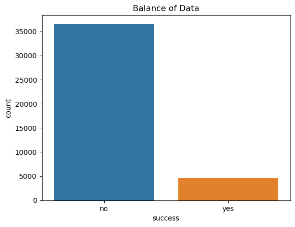
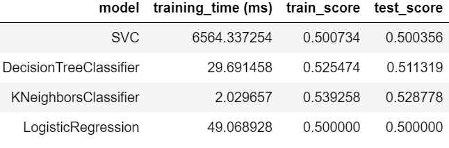
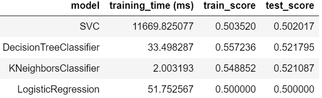
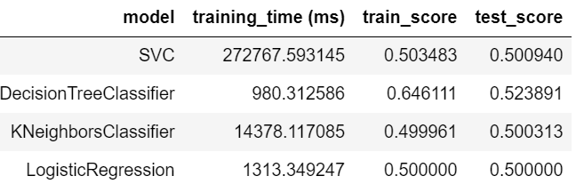
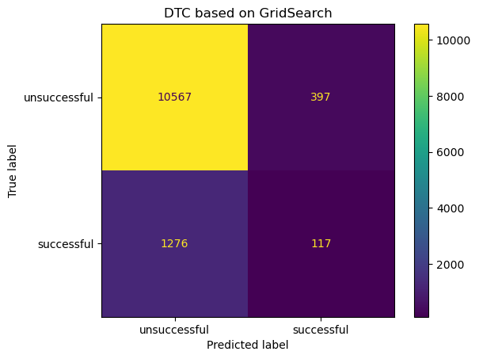

# Business Objective
The objective of this exercise is, using machine learning, coming up with model that tell us whether a customer would accept a bank product or not. The product used in this case is a bank deposit account.  
A bank can utilize this model before deciding to reach out to a customer, by measuring the likelihood of the customer accepting the offer or not.  
This way, a bank can target customers who are likely to take the deposit product in their campaign and bank resources can be much more effectively deployed.

# Data Understanding
The data is from a Portugese banking institution and is a collection of the results of multiple marketing campaigns. 
Data represents 17 marketing campaigns, for a total of 79354 contacts. 
Data has 21 features. For this exercise, columns used are as follows:
- age (numeric)
- job : type of job (categorical: 'admin.','blue-collar','entrepreneur','housemaid','management','retired','self-employed','services','student','technician','unemployed','unknown')
- marital : marital status (categorical: 'divorced','married','single','unknown'; note: 'divorced' means divorced or widowed)
- education (categorical: 'basic.4y','basic.6y','basic.9y','high.school','illiterate','professional.course','university.degree','unknown')
- default: has credit in default? (categorical: 'no','yes','unknown')
- housing: has housing loan? (categorical: 'no','yes','unknown')
- loan: has personal loan? (categorical: 'no','yes','unknown')
 
Output variable (desired target):
- y: has the client subscribed a term deposit? (binary: 'yes','no')
 
 
It is observed that data is highly inbalanced.

Data does not have any missing values.

# Data Preperation
Following categorical values are converted with OneHotEncoding:
- job
- marital
- education
- default
- housing
- loan

Following variables are scaled using StandardScaler:
- age

Data is then randomly split into training and test. 70% of the data is used for training and 30% is the data used for test purposes.

# Modeling
Precision of the model that is selected is important, because we would like to deploy bank resources effectively. Recall of the model is important as well, because we would like to capture most of the potential customers in our effort.

For those purposes we will focus on ROC AUC score througout our model selection process.

Modeling is done in 3 iterations:
## Iteration 1:
- job, marital, age features are arbitrarily selected.
- A baseline DummyClassifier is defined
- Then Logistic Regression, K-Nearest Neighbors (KNN), Decision Tree Classifier (DTC) and Support Vector Classifier (SVC) are used without hyper-parameter tuning.
- KNN performed better than other models on test data, with the least training time. It is marginally better than DTC with much faster training time.
  

## Iteration 2:
- Sequential feature selection is used using Ridge Regression to select the most relevant columns
- All models are re-evaluated based on the selected features
- DTC performed slightly better than KNN on test data. 
- It is also observed that Sequential feature selection did not significantly improve the score
  

## Iteration 3:
- All 7 features are included
- Grid search is run with various hyper-parameters on all 4 models
- DTC performed better than other models with the shortest training time
  

# Evaluation
It is observed that Sequential Feature Selection did not sigfinicantly improve the model performance.
At the end of iteration 3, DTC performed better than other models. However, throughout the iteration 1 and 2, DTC and KNN preformed equally well.

Model does not do particularly well on recall, as many positives are left out. However, precision is better than random. 23% of the marketing calls selected by this model is expected to tbe successful.

Banks can utilize this model to improve their chances of success compared to randomly calling customers.

# Next Steps
Additional variables that was not used in modeling should be further explored to improve model performance. 
Also, various methodologies for feature selection should be looked into, as Sequential Feature Selection did not yield optimal results. 
Due to time limitations, hyperparameters of SVC was not tuned, as the process is effort intensive. However, if tuned properly, SVC has the potential to outperform other models in this use case.
